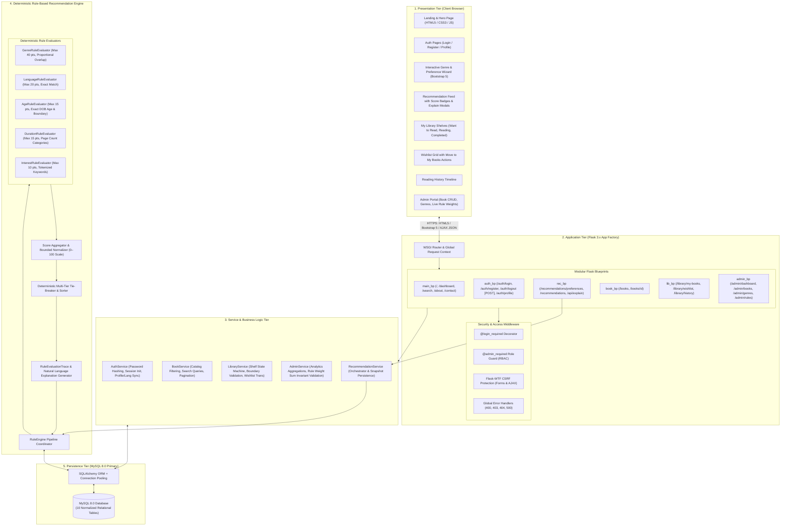
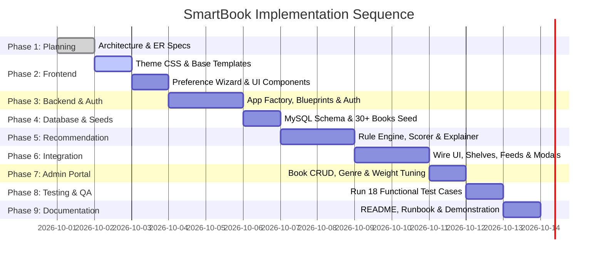

# SMARTBOOK — Corrected Phase 1 Engineering Specification & Architecture Blueprint

---

## 1. System Architecture Diagram



---

## 2. Backend Architecture: Blueprints, Services, Models, and Responsibilities

| Subsystem / Layer | Component Name | Primary Responsibility & Scope |
| :--- | :--- | :--- |
| **App Factory** | `create_app(config_name)` | Instantiates Flask app, binds extensions (SQLAlchemy, LoginManager, CSRFProtect), registers blueprints, and registers global HTTP error handlers. |
| **Blueprint** | `main_bp` | Serves public marketing views, user home dashboard, and universal search with filters. |
| **Blueprint** | `auth_bp` | Handles user registration, login, profile updates, and secure **POST `/auth/logout`** with CSRF token verification. |
| **Blueprint** | `rec_bp` | Manages preference wizard, recommendation pipeline, and `/api/recommendations/explain/<id>` JSON endpoint. |
| **Blueprint** | `book_bp` | Renders public browseable catalog, genre filtering, and individual book details with "Why Recommended" breakdown. |
| **Blueprint** | `lib_bp` | Handles shelf management, progress updates with page boundary checks (`current_page <= page_count`), idempotent wishlist toggles, and atomic wishlist-to-shelf migrations. |
| **Blueprint** | `admin_bp` | Restricted to `role='admin'`. Manages book CRUD, genre management, and live rule weight reconfiguration enforcing $\sum W = 100$. |
| **Service** | `AuthService` | Securely verifies credentials via PBKDF2:SHA256, manages user sessions, and synchronizes authoritative language preference. |
| **Service** | `BookService` | Executes paginated catalog queries, full-text searches, and book detail retrieval. |
| **Service** | `LibraryService` | Handles transactional shelf operations, progress bounds validation, duplicate-safe wishlist toggle, and audit logging into `reading_history`. |
| **Service** | `AdminService` | Validates that all active rule weights sum to exactly 100 before saving; aggregates dashboard KPIs. |
| **Service** | `RecommendationService` | Fetches active user preferences and candidate books, runs `RuleEngine`, records snapshots into `recommendation_history`, and returns ranked results. |

---

## 3. Complete MySQL Database ER Diagram & DDL Schema

### 3.1 Relational ER Diagram

```mermaid
erDiagram
    USERS ||--|| USER_PREFERENCES : "configures (1:1)"
    USERS ||--o{ USER_BOOKS : "tracks (1:N)"
    USERS ||--o{ WISHLIST : "saves (1:N)"
    USERS ||--o{ READING_HISTORY : "logs (1:N)"
    USERS ||--o{ RECOMMENDATION_HISTORY : "receives (1:N)"

    BOOKS ||--|{ BOOK_GENRES : "categorized_by (N:M)"
    GENRES ||--|{ BOOK_GENRES : "maps_to"

    USER_PREFERENCES ||--|{ USER_PREFERRED_GENRES : "selects (N:M)"
    GENRES ||--|{ USER_PREFERRED_GENRES : "assigned_to"

    BOOKS ||--o{ USER_BOOKS : "referenced_in (1:N)"
    BOOKS ||--o{ WISHLIST : "referenced_in (1:N)"
    BOOKS ||--o{ READING_HISTORY : "referenced_in (1:N)"

    USERS {
        INT id PK "AUTO_INCREMENT"
        VARCHAR_64 username UK "NOT NULL"
        VARCHAR_120 email UK "NOT NULL"
        VARCHAR_255 password_hash "NOT NULL"
        VARCHAR_100 full_name "NOT NULL"
        DATE date_of_birth "NOT NULL (Authoritative Age Source)"
        VARCHAR_20 preferred_language "NOT NULL DEFAULT 'English' (Authoritative Lang Source)"
        ENUM role "NOT NULL DEFAULT 'user' ('user', 'admin')"
        VARCHAR_255 profile_image "NULL"
        DATETIME created_at "NOT NULL DEFAULT CURRENT_TIMESTAMP"
        DATETIME updated_at "NOT NULL DEFAULT CURRENT_TIMESTAMP ON UPDATE CURRENT_TIMESTAMP"
    }

    GENRES {
        INT id PK "AUTO_INCREMENT"
        VARCHAR_50 name UK "NOT NULL"
        VARCHAR_50 slug UK "NOT NULL"
        VARCHAR_255 description "NULL"
    }

    BOOKS {
        INT id PK "AUTO_INCREMENT"
        VARCHAR_255 title "NOT NULL"
        VARCHAR_150 author "NOT NULL"
        VARCHAR_20 isbn UK "NULL (Optional with Unique constraint)"
        TEXT description "NOT NULL"
        VARCHAR_30 language "NOT NULL DEFAULT 'English'"
        INT publication_year "NOT NULL"
        INT page_count "NOT NULL"
        ENUM reading_duration "NOT NULL ('Short', 'Medium', 'Long')"
        INT min_age "NOT NULL DEFAULT 0"
        INT max_age "NOT NULL DEFAULT 99"
        DECIMAL_3_2 rating "NOT NULL DEFAULT 0.00"
        VARCHAR_255 cover_image "NOT NULL"
        BOOLEAN is_featured "NOT NULL DEFAULT FALSE"
        DATETIME created_at "NOT NULL DEFAULT CURRENT_TIMESTAMP"
    }

    BOOK_GENRES {
        INT book_id PK,FK "REFERENCES books(id) ON DELETE CASCADE"
        INT genre_id PK,FK "REFERENCES genres(id) ON DELETE CASCADE"
    }

    USER_PREFERENCES {
        INT id PK "AUTO_INCREMENT"
        INT user_id UK,FK "REFERENCES users(id) ON DELETE CASCADE"
        VARCHAR_30 preferred_language "NOT NULL DEFAULT 'English'"
        ENUM age_group "NOT NULL DEFAULT 'Adult' ('Kids', 'Teens', 'Young Adult', 'Adult', 'All Ages')"
        ENUM reading_duration "NOT NULL DEFAULT 'Any' ('Short', 'Medium', 'Long', 'Any')"
        TEXT interests "NULL (Optional Keywords)"
        DATETIME updated_at "NOT NULL DEFAULT CURRENT_TIMESTAMP ON UPDATE CURRENT_TIMESTAMP"
    }

    USER_PREFERRED_GENRES {
        INT preference_id PK,FK "REFERENCES user_preferences(id) ON DELETE CASCADE"
        INT genre_id PK,FK "REFERENCES genres(id) ON DELETE CASCADE"
    }

    USER_BOOKS {
        INT id PK "AUTO_INCREMENT"
        INT user_id FK "REFERENCES users(id) ON DELETE CASCADE"
        INT book_id FK "REFERENCES books(id) ON DELETE CASCADE"
        ENUM status "NOT NULL DEFAULT 'want_to_read' ('want_to_read', 'reading', 'completed')"
        INT current_page "NOT NULL DEFAULT 0"
        INT user_rating "NULL CHECK (1 to 5)"
        TEXT review "NULL"
        DATETIME added_at "NOT NULL DEFAULT CURRENT_TIMESTAMP"
        DATETIME updated_at "NOT NULL DEFAULT CURRENT_TIMESTAMP ON UPDATE CURRENT_TIMESTAMP"
    }

    WISHLIST {
        INT id PK "AUTO_INCREMENT"
        INT user_id FK "REFERENCES users(id) ON DELETE CASCADE"
        INT book_id FK "REFERENCES books(id) ON DELETE CASCADE"
        DATETIME added_at "NOT NULL DEFAULT CURRENT_TIMESTAMP"
    }

    READING_HISTORY {
        INT id PK "AUTO_INCREMENT"
        INT user_id FK "REFERENCES users(id) ON DELETE CASCADE"
        INT book_id FK "REFERENCES books(id) ON DELETE CASCADE"
        ENUM action "NOT NULL ('added', 'started', 'updated_progress', 'completed', 'reviewed')"
        VARCHAR_255 details "NULL"
        DATETIME created_at "NOT NULL DEFAULT CURRENT_TIMESTAMP"
    }

    RECOMMENDATION_RULES {
        INT id PK "AUTO_INCREMENT"
        VARCHAR_50 rule_name "NOT NULL"
        VARCHAR_50 rule_code UK "NOT NULL"
        ENUM category "NOT NULL ('genre', 'language', 'age', 'duration', 'interest')"
        INT max_weight "NOT NULL"
        BOOLEAN is_active "NOT NULL DEFAULT TRUE"
        TEXT description "NOT NULL"
    }

    RECOMMENDATION_HISTORY {
        INT id PK "AUTO_INCREMENT"
        INT user_id FK "REFERENCES users(id) ON DELETE CASCADE"
        DATETIME generated_at "NOT NULL DEFAULT CURRENT_TIMESTAMP"
        JSON preferences_snapshot "NOT NULL"
        JSON results_snapshot "NOT NULL"
    }
```



### 3.2 Corrected MySQL DDL Script

```sql
-- =============================================================================
-- SMARTBOOK CORRECTED DATABASE SCHEMA (MySQL 8.0+)
-- =============================================================================

CREATE DATABASE IF NOT EXISTS smartbook_db
CHARACTER SET utf8mb4
COLLATE utf8mb4_unicode_ci;

USE smartbook_db;

-- 1. USERS TABLE (Authoritative Source for DOB and Preferred Language)
CREATE TABLE IF NOT EXISTS users (
    id INT AUTO_INCREMENT PRIMARY KEY,
    username VARCHAR(64) NOT NULL UNIQUE,
    email VARCHAR(120) NOT NULL UNIQUE,
    password_hash VARCHAR(255) NOT NULL,
    full_name VARCHAR(100) NOT NULL,
    date_of_birth DATE NOT NULL,
    preferred_language VARCHAR(20) NOT NULL DEFAULT 'English',
    role ENUM('user', 'admin') NOT NULL DEFAULT 'user',
    profile_image VARCHAR(255) NULL,
    created_at DATETIME NOT NULL DEFAULT CURRENT_TIMESTAMP,
    updated_at DATETIME NOT NULL DEFAULT CURRENT_TIMESTAMP ON UPDATE CURRENT_TIMESTAMP,
    INDEX idx_user_email (email),
    INDEX idx_user_role (role)
) ENGINE=InnoDB DEFAULT CHARSET=utf8mb4 COLLATE=utf8mb4_unicode_ci;

-- 2. GENRES TABLE (15 Predefined Academic Genres)
CREATE TABLE IF NOT EXISTS genres (
    id INT AUTO_INCREMENT PRIMARY KEY,
    name VARCHAR(50) NOT NULL UNIQUE,
    slug VARCHAR(50) NOT NULL UNIQUE,
    description VARCHAR(255) NULL,
    INDEX idx_genre_slug (slug)
) ENGINE=InnoDB DEFAULT CHARSET=utf8mb4 COLLATE=utf8mb4_unicode_ci;

-- 3. BOOKS TABLE (ISBN is Optional NULL with Unique constraint)
CREATE TABLE IF NOT EXISTS books (
    id INT AUTO_INCREMENT PRIMARY KEY,
    title VARCHAR(255) NOT NULL,
    author VARCHAR(150) NOT NULL,
    isbn VARCHAR(20) NULL UNIQUE,
    description TEXT NOT NULL,
    language VARCHAR(30) NOT NULL DEFAULT 'English',
    publication_year INT NOT NULL,
    page_count INT NOT NULL,
    reading_duration ENUM('Short', 'Medium', 'Long') NOT NULL,
    min_age INT NOT NULL DEFAULT 0,
    max_age INT NOT NULL DEFAULT 99,
    rating DECIMAL(3, 2) NOT NULL DEFAULT 0.00,
    cover_image VARCHAR(255) NOT NULL,
    is_featured BOOLEAN NOT NULL DEFAULT FALSE,
    created_at DATETIME NOT NULL DEFAULT CURRENT_TIMESTAMP,
    INDEX idx_books_author (author),
    INDEX idx_books_language (language),
    INDEX idx_books_duration (reading_duration),
    INDEX idx_books_rating (rating),
    INDEX idx_books_featured (is_featured),
    FULLTEXT INDEX ft_books_search (title, author, description)
) ENGINE=InnoDB DEFAULT CHARSET=utf8mb4 COLLATE=utf8mb4_unicode_ci;

-- 4. BOOK_GENRES (ASSOCIATION TABLE)
CREATE TABLE IF NOT EXISTS book_genres (
    book_id INT NOT NULL,
    genre_id INT NOT NULL,
    PRIMARY KEY (book_id, genre_id),
    CONSTRAINT fk_bg_book FOREIGN KEY (book_id) REFERENCES books (id) ON DELETE CASCADE,
    CONSTRAINT fk_bg_genre FOREIGN KEY (genre_id) REFERENCES genres (id) ON DELETE CASCADE,
    INDEX idx_bg_genre (genre_id)
) ENGINE=InnoDB DEFAULT CHARSET=utf8mb4 COLLATE=utf8mb4_unicode_ci;

-- 5. USER_PREFERENCES TABLE (Synchronized with users.preferred_language)
CREATE TABLE IF NOT EXISTS user_preferences (
    id INT AUTO_INCREMENT PRIMARY KEY,
    user_id INT NOT NULL UNIQUE,
    preferred_language VARCHAR(30) NOT NULL DEFAULT 'English',
    age_group ENUM('Kids', 'Teens', 'Young Adult', 'Adult', 'All Ages') NOT NULL DEFAULT 'Adult',
    reading_duration ENUM('Short', 'Medium', 'Long', 'Any') NOT NULL DEFAULT 'Any',
    interests TEXT NULL,
    updated_at DATETIME NOT NULL DEFAULT CURRENT_TIMESTAMP ON UPDATE CURRENT_TIMESTAMP,
    CONSTRAINT fk_up_user FOREIGN KEY (user_id) REFERENCES users (id) ON DELETE CASCADE
) ENGINE=InnoDB DEFAULT CHARSET=utf8mb4 COLLATE=utf8mb4_unicode_ci;

-- 6. USER_PREFERRED_GENRES (ASSOCIATION TABLE)
CREATE TABLE IF NOT EXISTS user_preferred_genres (
    preference_id INT NOT NULL,
    genre_id INT NOT NULL,
    PRIMARY KEY (preference_id, genre_id),
    CONSTRAINT fk_upg_pref FOREIGN KEY (preference_id) REFERENCES user_preferences (id) ON DELETE CASCADE,
    CONSTRAINT fk_upg_genre FOREIGN KEY (genre_id) REFERENCES genres (id) ON DELETE CASCADE
) ENGINE=InnoDB DEFAULT CHARSET=utf8mb4 COLLATE=utf8mb4_unicode_ci;

-- 7. USER_BOOKS TABLE (PERSONAL SHELVES WITH UNIQUE CONSTRAINT)
CREATE TABLE IF NOT EXISTS user_books (
    id INT AUTO_INCREMENT PRIMARY KEY,
    user_id INT NOT NULL,
    book_id INT NOT NULL,
    status ENUM('want_to_read', 'reading', 'completed') NOT NULL DEFAULT 'want_to_read',
    current_page INT NOT NULL DEFAULT 0,
    user_rating INT NULL CHECK (user_rating BETWEEN 1 AND 5),
    review TEXT NULL,
    added_at DATETIME NOT NULL DEFAULT CURRENT_TIMESTAMP,
    updated_at DATETIME NOT NULL DEFAULT CURRENT_TIMESTAMP ON UPDATE CURRENT_TIMESTAMP,
    UNIQUE KEY uk_user_book (user_id, book_id),
    CONSTRAINT fk_ub_user FOREIGN KEY (user_id) REFERENCES users (id) ON DELETE CASCADE,
    CONSTRAINT fk_ub_book FOREIGN KEY (book_id) REFERENCES books (id) ON DELETE CASCADE,
    INDEX idx_ub_status (status)
) ENGINE=InnoDB DEFAULT CHARSET=utf8mb4 COLLATE=utf8mb4_unicode_ci;

-- 8. WISHLIST TABLE (WITH UNIQUE CONSTRAINT)
CREATE TABLE IF NOT EXISTS wishlist (
    id INT AUTO_INCREMENT PRIMARY KEY,
    user_id INT NOT NULL,
    book_id INT NOT NULL,
    added_at DATETIME NOT NULL DEFAULT CURRENT_TIMESTAMP,
    UNIQUE KEY uk_wishlist_user_book (user_id, book_id),
    CONSTRAINT fk_wl_user FOREIGN KEY (user_id) REFERENCES users (id) ON DELETE CASCADE,
    CONSTRAINT fk_wl_book FOREIGN KEY (book_id) REFERENCES books (id) ON DELETE CASCADE
) ENGINE=InnoDB DEFAULT CHARSET=utf8mb4 COLLATE=utf8mb4_unicode_ci;

-- 9. READING_HISTORY TABLE (AUDIT LOG)
CREATE TABLE IF NOT EXISTS reading_history (
    id INT AUTO_INCREMENT PRIMARY KEY,
    user_id INT NOT NULL,
    book_id INT NOT NULL,
    action ENUM('added', 'started', 'updated_progress', 'completed', 'reviewed') NOT NULL,
    details VARCHAR(255) NULL,
    created_at DATETIME NOT NULL DEFAULT CURRENT_TIMESTAMP,
    CONSTRAINT fk_rh_user FOREIGN KEY (user_id) REFERENCES users (id) ON DELETE CASCADE,
    CONSTRAINT fk_rh_book FOREIGN KEY (book_id) REFERENCES books (id) ON DELETE CASCADE,
    INDEX idx_rh_user_created (user_id, created_at)
) ENGINE=InnoDB DEFAULT CHARSET=utf8mb4 COLLATE=utf8mb4_unicode_ci;

-- 10. RECOMMENDATION_RULES TABLE (Active weights must sum to 100)
CREATE TABLE IF NOT EXISTS recommendation_rules (
    id INT AUTO_INCREMENT PRIMARY KEY,
    rule_name VARCHAR(50) NOT NULL,
    rule_code VARCHAR(50) NOT NULL UNIQUE,
    category ENUM('genre', 'language', 'age', 'duration', 'interest') NOT NULL,
    max_weight INT NOT NULL,
    is_active BOOLEAN NOT NULL DEFAULT TRUE,
    description TEXT NOT NULL
) ENGINE=InnoDB DEFAULT CHARSET=utf8mb4 COLLATE=utf8mb4_unicode_ci;

-- 11. RECOMMENDATION_HISTORY TABLE
CREATE TABLE IF NOT EXISTS recommendation_history (
    id INT AUTO_INCREMENT PRIMARY KEY,
    user_id INT NOT NULL,
    generated_at DATETIME NOT NULL DEFAULT CURRENT_TIMESTAMP,
    preferences_snapshot JSON NOT NULL,
    results_snapshot JSON NOT NULL,
    CONSTRAINT fk_rechist_user FOREIGN KEY (user_id) REFERENCES users (id) ON DELETE CASCADE,
    INDEX idx_rechist_user_gen (user_id, generated_at)
) ENGINE=InnoDB DEFAULT CHARSET=utf8mb4 COLLATE=utf8mb4_unicode_ci;
```

---

## 4. Final Project Folder Structure

```text
SmartBook/
├── app.py                      # Application entry point, CLI seeder commands, and WSGI launcher
├── config.py                   # Environment configuration classes (Dev, Test, Prod)
├── requirements.txt            # Python dependencies
├── .env.example                # Sample environment variables
├── .gitignore                  # Git ignore specifications
├── README.md                   # Setup guide and technical documentation
│
├── app/
│   ├── __init__.py             # Flask App Factory (create_app), extension instantiations
│   │
│   ├── models/                 # SQLAlchemy ORM Models
│   │   ├── __init__.py         # Package model registry
│   │   ├── user.py             # User and UserPreferences models
│   │   ├── book.py             # Book, Genre, and book_genres association table
│   │   ├── library.py          # UserBooks, Wishlist, and ReadingHistory models
│   │   └── rule.py             # RecommendationRules and RecommendationHistory models
│   │
│   ├── routes/                 # Flask Blueprints
│   │   ├── __init__.py
│   │   ├── main.py             # Public landing, home dashboard, universal search, about, contact
│   │   ├── auth.py             # Registration, login, POST logout, profile update
│   │   ├── recommendations.py  # Preferences wizard, recommendation results, JSON explain API
│   │   ├── books.py            # Public catalog, book details, genre filtering
│   │   ├── library.py          # Shelves management, progress validation, wishlist toggle, history
│   │   └── admin.py            # Admin dashboard, book CRUD, genre CRUD, weight-sum rule config
│   │
│   ├── services/               # Reusable Business Logic Services
│   │   ├── __init__.py
│   │   ├── auth_service.py     # Password hashing, session setup, language synchronization
│   │   ├── book_service.py     # Filtered book queries, pagination, search
│   │   ├── library_service.py  # Shelf state machine, page boundary check, atomic wishlist moves
│   │   └── admin_service.py    # Analytics aggregations, weight sum invariant validation (=100)
│   │
│   ├── recommendation/         # Rule Engine Subsystem
│   │   ├── __init__.py         # Subsystem export (RuleEngine, RuleEvaluationTrace)
│   │   ├── engine.py           # Pipeline orchestrator and candidate retrieval
│   │   ├── rules.py            # Individual rule evaluators (Genre, Language, Age, Duration, Interest)
│   │   ├── scorer.py           # Proportional overlap and bounded scoring calculators
│   │   ├── explainer.py        # Natural language explanation generator and trace builder
│   │   └── tie_breaker.py      # Multi-tier deterministic sorting and tie-breaker
│   │
│   ├── forms/                  # WTForms Form Definitions & Input Validators
│   │   ├── __init__.py
│   │   ├── auth_forms.py       # RegistrationForm, LoginForm, ProfileForm
│   │   ├── preference_forms.py # PreferenceSelectionForm
│   │   ├── library_forms.py    # ShelfUpdateForm, RatingReviewForm
│   │   └── admin_forms.py      # BookForm, GenreForm, RuleWeightForm
│   │
│   └── utils/                  # Helper Utilities and Decorators
│       ├── __init__.py
│       ├── decorators.py       # @login_required, @admin_required
│       ├── helpers.py          # DOB age calculator, string sanitizers, keyword tokenizers
│       └── constants.py        # 15 genres list, duration thresholds, default weights
│
├── templates/                  # Jinja2 HTML Templates
│   ├── base.html               # Master layout with Navbar, Flash messages, Footer, Modals
│   ├── components/             # Reusable UI Snippets
│   │   ├── _book_card.html     # Standardized responsive book card with match score badge
│   │   ├── _explain_modal.html # Dynamic match breakdown & rule trigger modal
│   │   ├── _flash.html         # Bootstrap alert renderers
│   │   └── _pagination.html    # Universal pagination component
│   ├── auth/
│   │   ├── login.html          # User login page
│   │   ├── register.html       # User registration page
│   │   └── profile.html        # User profile viewer & editor
│   ├── main/
│   │   ├── index.html          # Public landing page with hero and carousel
│   │   ├── dashboard.html      # Authenticated user dashboard with active shelves & quick recs
│   │   ├── search.html         # Universal faceted search interface
│   │   ├── about.html          # Academic project overview
│   │   └── contact.html        # Contact / Feedback page
│   ├── recommendations/
│   │   ├── preferences.html    # Interactive genre chips & preference setup wizard
│   │   └── results.html        # Recommendation feed with sorting, filters, and match cards
│   ├── books/
│   │   ├── catalog.html        # Browseable book catalog with genre side-menu
│   │   └── details.html        # Detailed book view with "Why This Book Is Recommended"
│   ├── library/
│   │   ├── my_books.html       # Shelf tabs: Want to Read (n), Reading (n), Completed (n)
│   │   ├── wishlist.html       # Saved books grid with Move to My Books actions
│   │   └── history.html        # Chronological timeline of reading milestones
│   └── admin/
│       ├── dashboard.html      # Admin KPI cards and summary statistics
│       ├── books_list.html     # Book management table with edit/delete actions
│       ├── book_form.html      # Create/Edit book form with genre checkboxes
│       ├── genres_list.html    # Genre master management table
│       └── rules_list.html     # Live rule weights tuning form enforcing sum=100
│
├── static/                     # Static Client Assets
│   ├── css/
│   │   ├── variables.css       # Theme color palette (#5842BE, #F3F0FF, #FF7675)
│   │   ├── style.css           # Global typography, buttons, layout, navbar, footer
│   │   └── components.css      # Book cards, score badges, genre chips, timeline
│   ├── js/
│   │   ├── main.js             # General app interactions, toast alerts, tooltips
│   │   ├── preferences.js      # Interactive multi-genre chip selection handling
│   │   ├── recommendation.js   # Live AJAX explainability modal and client-side sorting
│   │   └── library.js          # AJAX shelf updates and wishlist toggle buttons
│   ├── images/
│   │   ├── logo.svg            # SmartBook brand logo
│   │   ├── hero_illustration.svg
│   │   └── empty_state.svg     # Friendly empty state illustrations
│   └── book_covers/            # Curated local covers for 30+ seed books
│
├── database/
│   ├── schema.sql              # Clean DDL script for MySQL table creation
│   └── seed_data.py            # Comprehensive database seeder (30+ books, 15 genres, admin user, default rules)
│
└── tests/                      # Automated Test Suite (Pytest / Unittest)
    ├── __init__.py
    ├── conftest.py             # Test fixtures (test client, in-memory DB, dummy user/admin/books)
    ├── test_auth.py            # Authentication, registration, POST logout, language sync
    ├── test_recommendation.py  # Precision unit tests for scoring rules, overlap, bounds, and normalizer
    ├── test_library.py         # Progress boundaries, duplicate safety, atomic moves, history
    ├── test_search.py          # Search filtering and keyword matching tests
    └── test_admin.py           # Admin RBAC enforcement and weight-sum validation (=100) tests
```

---

## 5. All Frontend Pages and Backend Routes

| Frontend View / Page | Template File | Corresponding Backend Route | HTTP Methods | Access Level | Primary Feature |
| :--- | :--- | :--- | :--- | :--- | :--- |
| **Landing Page** | `templates/main/index.html` | `/` | `GET` | Public | Hero banner, key system features, curated book carousel, and CTAs. |
| **User Dashboard** | `templates/main/dashboard.html` | `/dashboard` | `GET` | User | Personalized greeting, active shelf summaries, quick recommendations, and preference tags. |
| **Universal Search** | `templates/main/search.html` | `/search` | `GET` | Public | Full-text query (`q`) with genre, language, duration filters, and sorting. |
| **About Page** | `templates/main/about.html` | `/about` | `GET` | Public | Explanation of rule-based recommendation methodology and academic context. |
| **Contact Page** | `templates/main/contact.html` | `/contact` | `GET`, `POST` | Public | Project contact form with flash feedback. |
| **Registration** | `templates/auth/register.html` | `/auth/register` | `GET`, `POST` | Public | Form validation, password confirmation, hashing, and initial preference binding. |
| **Login** | `templates/auth/login.html` | `/auth/login` | `GET`, `POST` | Public | Credential verification, session initialization, and `next` redirect handler. |
| **User Logout** | — | `/auth/logout` | **`POST`** | User | **POST with CSRF protection**. Destroys session and redirects to public landing. |
| **User Profile** | `templates/auth/profile.html` | `/auth/profile` | `GET`, `POST` | User | View/Edit full name, DOB, language (synchronizes with preferences), and profile image. |
| **Preference Wizard** | `templates/recommendations/preferences.html` | `/recommendations/preferences` | `GET`, `POST` | User | Interactive 15-genre tag selector, reading pace, and optional interest keywords. Synchronizes language with profile. |
| **Recommendation Feed** | `templates/recommendations/results.html` | `/recommendations` | `GET` | User | Ranked list of recommended books with match scores, badges, and filters. |
| **Explain Modal API** | `templates/components/_explain_modal.html` | `/api/recommendations/explain/<id>` | `GET` | User | JSON endpoint supplying exact score breakdown and rule explanation texts. |
| **Book Catalog** | `templates/books/catalog.html` | `/books` | `GET` | Public | Browse all available books with genre sidebar and pagination. |
| **Book Details** | `templates/books/details.html` | `/books/<id>` | `GET` | Public | Full metadata, synopsis, reviews, and personalized "Why Recommended" card. |
| **My Books** | `templates/library/my_books.html` | `/library/my-books` | `GET` | User | Tabbed shelf view (*Want to Read*, *Currently Reading*, *Completed*). |
| **Shelf Add / Update** | — | `/library/my-books/add`, `/update` | `POST` | User | Add to shelf or update progress (enforcing $0 \le \text{page} \le \text{page\_count}$). |
| **Shelf Remove** | — | `/library/my-books/remove/<id>` | `POST` | User | Removes book from personal shelf. |
| **Wishlist** | `templates/library/wishlist.html` | `/library/wishlist` | `GET` | User | Saved books grid with Move to My Books action. |
| **Wishlist Toggle** | — | `/library/wishlist/toggle/<id>` | `POST` | User | Idempotent AJAX endpoint toggling bookmark state without page reload. |
| **Wishlist Move** | — | `/library/wishlist/move-to-books/<id>` | `POST` | User | **Atomic transaction**: Removes item from wishlist and creates/updates personal reading shelf. |
| **Reading History** | `templates/library/history.html` | `/library/reading-history` | `GET` | User | Chronological timeline of reading milestones and status changes. |
| **Admin Dashboard** | `templates/admin/dashboard.html` | `/admin` | `GET` | Admin | KPI metrics (users, books, recs) and quick management actions. |
| **Admin Books List** | `templates/admin/books_list.html` | `/admin/books` | `GET` | Admin | Searchable inventory datatable with edit/delete triggers. |
| **Admin Book Form** | `templates/admin/book_form.html` | `/admin/books/new`, `/edit/<id>` | `GET`, `POST` | Admin | Create or edit book record and genre associations. |
| **Admin Book Delete** | — | `/admin/books/delete/<id>` | `POST` | Admin | Deletes book record and cascaded associations. |
| **Admin Genres List** | `templates/admin/genres_list.html` | `/admin/genres` | `GET`, `POST` | Admin | Manage the 15 system genres. |
| **Admin Rules Config**| `templates/admin/rules_list.html` | `/admin/rules` | `GET`, `POST` | Admin | Live weight tuning form **enforcing $\sum W_{\text{active}} = 100$ invariant**. |

---

## 6. Simplified Deterministic Recommendation Algorithm & Exact Formulas

The Recommendation Engine operates deterministically on a **100-point scale**.

$$\text{Total Match Score } S(u, b) = S_{\text{genre}}(u, b) + S_{\text{lang}}(u, b) + S_{\text{age}}(u, b) + S_{\text{dur}}(u, b) + S_{\text{int}}(u, b)$$

```text
Default Invariant Weights Distribution (Sum = Exactly 100 Points):
├── 1. Genre Compatibility:       40 Points (Max)
├── 2. Language Compatibility:    20 Points (Max)
├── 3. Age Suitability:           15 Points (Max)
├── 4. Reading Duration Match:    15 Points (Max)
└── 5. Interest Compatibility:    10 Points (Max)
------------------------------------------------
Total Maximum Score:             100 Points
```

---

### 6.1 Component Mathematical Formulations

#### 1. Simplified Multi-Genre Proportional Overlap ($S_{\text{genre}}$, Max: 40 pts)
Let $G_u$ be the set of genres selected by the user ($|G_u| \ge 1$).
Let $G_b$ be the set of genres associated with book $b$ ($|G_b| \ge 1$).
Let $k = |G_u \cap G_b|$ be the number of matching genres.

$$\text{Genre Score } S_{\text{genre}}(u, b) = 40 \times \left(\frac{k}{|G_u|}\right)$$

*(Synergy bonus removed to ensure transparent, linear explainability).*

*Demonstration Examples:*
- User selects `[Sci-Fi, Thriller, Mystery]` ($|G_u|=3$). Book has `[Sci-Fi, Thriller]` ($k=2$).
  $$S_{\text{genre}} = 40 \times \left(\frac{2}{3}\right) = 26.67 \approx 27\text{ pts}$$
- User selects `[Fiction]`, Book has `[Fiction, Mystery]`. $k=1, |G_u|=1 \implies S_{\text{genre}} = 40 \times (1/1) = 40\text{ pts}$.
- User selects `[Romance, Fantasy]`, Book has `[Crime]`. $k=0 \implies S_{\text{genre}} = 0\text{ pts}$.

---

#### 2. Language Matching ($S_{\text{lang}}$, Max: 20 pts)
Uses authoritative `users.preferred_language` ($L_u$) and book language ($L_b$):
$$S_{\text{lang}}(u, b) = \begin{cases} 20 & \text{if } \text{lower}(L_u) = \text{lower}(L_b) \\ 0 & \text{otherwise} \end{cases}$$

---

#### 3. Age Suitability from Authoritative Date of Birth ($S_{\text{age}}$, Max: 15 pts)
Authoritative user age $A_u$ is calculated from `users.date_of_birth`:
$$A_u = \text{CurrentYear} - \text{BirthYear} - \left(1 \text{ if current\_date } < \text{birth\_date\_this\_year else } 0\right)$$
Book age range is $[\text{min\_age}_b, \text{max\_age}_b]$:
$$S_{\text{age}}(u, b) = \begin{cases}
15 & \text{if } \text{min\_age}_b \le A_u \le \text{max\_age}_b \\
8 & \text{if } \min(|A_u - \text{min\_age}_b|, |A_u - \text{max\_age}_b|) \le 2 \quad (\text{Borderline near match}) \\
0 & \text{otherwise}
\end{cases}$$

*(The `age_group` column is strictly a UI display tag and has no redundant scoring logic).*

---

#### 4. Reading Duration Match ($S_{\text{dur}}$, Max: 15 pts)
Book page count classification:
- **Short**: $< 200 \text{ pages}$ | **Medium**: $200 \text{ to } 450 \text{ pages}$ | **Long**: $> 450 \text{ pages}$

User duration preference $D_u \in \{\text{'Short'}, \text{'Medium'}, \text{'Long'}, \text{'Any'}\}$:
$$S_{\text{dur}}(u, b) = \begin{cases}
15 & \text{if } D_u = \text{'Any'} \text{ or } D_u = D_b \\
5 & \text{if } (D_u = \text{'Short'} \land D_b = \text{'Medium'}) \lor (D_u = \text{'Long'} \land D_b = \text{'Medium'}) \\
0 & \text{if } (D_u = \text{'Short'} \land D_b = \text{'Long'}) \lor (D_u = \text{'Long'} \land D_b = \text{'Short'})
\end{cases}$$

---

#### 5. Thematic Interest Match & Empty Interest Transparency ($S_{\text{int}}$, Max: 10 pts)
Let $T_u$ be tokenized user interest keywords. If user left interests empty ($T_u = \emptyset$):
$$S_{\text{int}}(u, b) = 0\text{ pts}$$

If user specified interests:
$$S_{\text{int}}(u, b) = \min\left(10, |T_u \cap T_b| \times 3.5\right)$$

*Score Transparency Rule:*
Scores are **never rescaled** or artificially inflated if optional interests are empty. The final score is shown out of 100 based on evaluated criteria, and the trace explicitly states that optional interests were unselected.

---

### 6.2 Deterministic Multi-Level Tie-Breaking
1. **Total Compatibility Score ($S_{\text{final}}$)** (Descending)
2. **Genre Match Score ($S_{\text{genre}}$)** (Descending)
3. **Book Average Rating** (Descending)
4. **Publication Year** (Descending — newer books prioritized)
5. **Book Title Alphabetical** (Ascending — stable determinism)

---

## 7. Recommendation Explanation Generator & Trace Binding

Every recommendation explanation is constructed directly from the active `RuleEvaluationTrace`:

```python
class RuleEvaluationTrace:
    def __init__(self, book):
        self.book_id = book.id
        self.book_title = book.title
        self.book_cover = book.cover_image
        self.total_score = 0
        self.breakdown = {}
        self.rules_triggered = []
        self.explanations = []
        self.badges = []

    def to_dict(self):
        return {
            'book_id': self.book_id,
            'book_title': self.book_title,
            'match_score': self.total_score,
            'breakdown': self.breakdown,
            'rules_triggered': self.rules_triggered,
            'explanations': self.explanations,
            'badges': self.badges
        }
```

### Explanation Templates Bound to Rule Triggers

| Rule Code | Trigger Condition | Points Awarded | Human-Readable Explanation String | UI Badge Pill |
| :--- | :--- | :--- | :--- | :--- |
| `RULE_GENRE_MATCH` | $k \ge 1$ | $S_{\text{genre}}$ (up to 40) | *"Matches {k} of your {total_user_genres} selected genres: {matched_genre_names}. (+{pts} pts)"* | `{k}/{total} Genres Matched` |
| `RULE_LANG_MATCH` | $L_u = L_b$ | 20 | *"Available in your preferred reading language ({language}). (+20 pts)"* | `{Language}` |
| `RULE_AGE_EXACT` | $\text{min}_b \le A_u \le \text{max}_b$ | 15 | *"Appropriate for your age ({age} years old, book bracket {min}-{max}). (+15 pts)"* | `Age Appropriate` |
| `RULE_AGE_BORDER` | Near age match | 8 | *"Close match for your age bracket. (+8 pts)"* | `Borderline Age` |
| `RULE_DUR_MATCH` | $D_u = D_b$ or $D_u = \text{'Any'}$ | 15 | *"Fits your {duration} reading pace preference (~{page_count} pages). (+15 pts)"* | `{Duration} Read` |
| `RULE_DUR_ADJACENT`| Adjacent duration | 5 | *"Near match for your reading length preference. (+5 pts)"* | `Approx. Duration` |
| `RULE_INT_MATCH` | $\|T_u \cap T_b\| \ge 1$ | Up to 10 | *"Matches your specific interests in '{matched_keywords}'. (+{pts} pts)"* | `Topic Match` |
| `RULE_INT_EMPTY` | $T_u = \emptyset$ | 0 | *"Interests: Optional field not specified (0 pts evaluated)."* | `No Topic Filters` |

---

## 8. Library Operations, Boundary Validations & Transactional Safety

### 8.1 Reading Progress Validation & Auto-Completion
- Form & API reject invalid page values: $0 \le \text{current\_page} \le \text{book.page\_count}$.
- **Auto-Completion State Transition**: If `current_page == book.page_count`, the system automatically updates status to `'completed'` and logs a `"completed"` audit event in `reading_history`.

### 8.2 Duplicate-Safe Operations & Atomic Wishlist Migration
- **Duplicate Shelf Addition**: `INSERT ... ON DUPLICATE KEY UPDATE` (or SQLAlchemy merge) safely updates the shelf record rather than crashing or creating duplicate rows.
- **Duplicate Wishlist Addition**: Returns `{success: true, in_wishlist: true}` idempotently.
- **Atomic Wishlist Move**: Executed within a single database transaction:
  ```python
  def move_wishlist_to_books(user_id, book_id, target_status):
      with db.session.begin():
          Wishlist.query.filter_by(user_id=user_id, book_id=book_id).delete()
          user_book = UserBooks.query.filter_by(user_id=user_id, book_id=book_id).first()
          if not user_book:
              user_book = UserBooks(user_id=user_id, book_id=book_id, status=target_status)
              db.session.add(user_book)
          else:
              user_book.status = target_status
  ```

---

## 9. Authentication, Language Sync, and Admin Weight Invariant Enforcement

1. **Synchronized Preferred Language**:
   - `users.preferred_language` is the single source of truth.
   - When a user updates language in `/auth/profile` or `/recommendations/preferences`, both `users.preferred_language` and `user_preferences.preferred_language` are updated simultaneously in the transaction.

2. **Secure POST Logout**:
   - Route: `POST /auth/logout`
   - Form / Button in navbar includes `<input type="hidden" name="csrf_token" value="{{ csrf_token() }}"/>`.
   - Rejects GET requests to prevent accidental or malicious link-prefetch logouts.

3. **Admin Rule Weight Sum Invariant ($\sum W_{\text{active}} = 100$)**:
   - `AdminService.update_rule_weights(weights_dict)` computes $\sum W_{\text{active}}$.
   - If $\sum W_{\text{active}} \neq 100$, the transaction is aborted, a descriptive validation error is returned (*"Total active rule weights must equal exactly 100 (current sum: X)"*), and database state remains unchanged.

---

## 10. Comprehensive Functional and Unit Test Plan (18 Test Cases)

| Test ID | Module | Test Objective | Preconditions | Input / Action | Expected Result | Pass/Fail Criteria |
| :--- | :--- | :--- | :--- | :--- | :--- | :--- |
| **TC-AUTH-01** | Auth | User Registration | Unregistered email. | Submit valid registration form (valid email, password, DOB). | User created in DB; password hashed; redirected to dashboard. | Plaintext password not stored in DB. |
| **TC-AUTH-02** | Auth | Duplicate Email Check | Existing email in DB. | Submit registration with duplicate email. | Registration rejected; inline form validation error displayed. | No duplicate row inserted in `users`. |
| **TC-AUTH-03** | Auth | Login Success & Session | Registered user. | Submit correct username and password. | `session['user_id']` set; redirected to dashboard. | HTTP 302 to `/dashboard`. |
| **TC-AUTH-04** | Auth | POST Logout Security | Logged in user. | Send `POST /auth/logout` with valid CSRF token. | Session cleared; redirected to landing page. `GET /auth/logout` returns 405 Method Not Allowed. | Session destroyed securely via POST. |
| **TC-AUTH-05** | Auth | Language Synchronization | Logged in user. | Update preferred language to "Hindi" in profile. | Both `users.preferred_language` and `user_preferences.preferred_language` updated to "Hindi". | Language is strictly synchronized. |
| **TC-REC-01** | Rec Engine | Perfect 100-Point Match | User profile configured. | Candidate book matches genre (1/1), language, age, duration, interest. | Total score = $40 + 20 + 15 + 15 + 10 = 100\%$; all 5 rules triggered. | Match score == 100; correct breakdown. |
| **TC-REC-02** | Rec Engine | Simplified Proportional Genre | User selects 3 genres. | Book matches 2 of the 3 genres ($k=2, |G_u|=3$). | Genre score computes $40 \times (2/3) \approx 26.67 \implies 27\text{ pts}$. No bonus applied. | Genre score == 27. |
| **TC-REC-03** | Rec Engine | Missing/Empty Interests | User interests = `None` or `""`. | Evaluate candidate book matching all other rules. | Score = $40 + 20 + 15 + 15 + 0 = 90\%$. Score is NOT inflated/rescaled. Explanation notes empty interests. | Score == 90; trace notes unselected interests. |
| **TC-REC-04** | Rec Engine | Age Calculation from DOB | User DOB is 2000-01-01 (Age 26). | Book age bracket is `[18, 50]`. | `users.date_of_birth` used to compute age 26; $S_{\text{age}} = 15\text{ pts}$. | Age score == 15 pts. |
| **TC-REC-05** | Rec Engine | Trace-to-Explanation Binding | Any evaluated book. | Execute `RuleEngine.evaluate()`. | Trace generates exact list of explanations corresponding to triggered rules. | Explanations accurately describe triggered rules. |
| **TC-LIB-01** | Library | Progress Boundary Valid | Book has 300 pages. | POST `/library/my-books/update` with `current_page=150`. | Valid update; `user_books.current_page` saved as 150. | Progress saved successfully. |
| **TC-LIB-02** | Library | Progress Boundary Rejection | Book has 300 pages. | POST `/library/my-books/update` with `current_page=350`. | Rejected with validation error: page cannot exceed book page count. | Database remains unchanged. |
| **TC-LIB-03** | Library | Auto-Complete on Final Page | Book has 300 pages. | POST `/library/my-books/update` with `current_page=300`. | Status automatically updates to `'completed'`; history log records completion. | Status == 'completed'. |
| **TC-LIB-04** | Library | Idempotent Wishlist Toggle | Book not in wishlist. | POST `/library/wishlist/toggle/5` twice. | First call adds to wishlist; second call removes it. No duplicate key crash. | Toggle state flips cleanly. |
| **TC-LIB-05** | Library | Atomic Move Wishlist to Shelf| Book in wishlist. | POST `/library/wishlist/move-to-books/5` with `status='reading'`. | Book deleted from `wishlist` and present in `user_books` with status `'reading'`. | Atomic transaction succeeds. |
| **TC-ADM-01** | Admin | Weight Sum Invariant Valid | Admin logged in. | POST `/admin/rules` with weights: Genre=40, Lang=20, Age=15, Dur=15, Int=10 (Sum=100). | Configuration saved successfully. | DB updated; flash success. |
| **TC-ADM-02** | Admin | Weight Sum Invariant Rejection| Admin logged in. | POST `/admin/rules` with weights summing to 90 or 105. | Update rejected; error message displayed; DB unchanged. | Invariant strictly enforced ($\sum W = 100$). |
| **TC-ADM-03** | Admin | Book with Optional ISBN | Admin logged in. | POST `/admin/books/new` with `isbn=""` (NULL) for curated classic book. | Book successfully created with `isbn=NULL`. Subsequent NULL ISBN books also succeed. | Unique constraint allows multiple NULLs in MySQL. |

---

## 11. Development Milestones & Implementation Sequence



---

## 12. Corrected Phase 1 Completion Summary

### Corrected Architectural Highlights
1. **Genre Scoring**: Clean proportional formula $S_{\text{genre}} = 40 \times (k / |G_u|)$ with synergy bonus removed.
2. **Weight Sum Invariant**: $\sum W_{\text{active}} = 100$ strictly enforced in `AdminService` and validated on updates.
3. **Authoritative Age**: Calculated dynamically from `users.date_of_birth`; `age_group` is purely a UI display tag.
4. **Authoritative Language**: `users.preferred_language` synchronizes across profile and recommendation preferences.
5. **Secure Logout**: Changed to `POST /auth/logout` with CSRF protection.
6. **Reading Progress Bounds**: Strict validation ($0 \le \text{page} \le \text{page\_count}$) with automatic transition to `'completed'`.
7. **Transactional & Duplicate-Safe Operations**: Idempotent shelf/wishlist toggles and atomic wishlist-to-shelf migration.
8. **Optional ISBN**: `books.isbn` is `NULL UNIQUE`, allowing curated entries without ISBNs.
9. **Unscaled Score Transparency**: Empty optional interests yield $0\text{ pts}$ without score inflation; explanation trace explicitly states unselected interest status.
10. **Trace-Driven Explanations**: 100% of explanation badges and text strings are generated from the active `RuleEvaluationTrace`.
11. **Expanded Test Suite**: 18 comprehensive functional and unit tests with clear pass/fail criteria.
