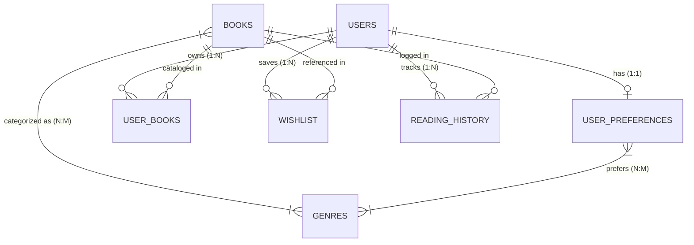

# SmartBook — Comprehensive Backend & Database Integration Documentation

## 1. System Architecture Overview

SmartBook is built on a modular Python Flask application using SQLAlchemy ORM with support for MySQL (production) and SQLite (development/testing).

```
SmartBook/
├── app.py                     # Application Factory & Core Server Configuration
├── config.py                  # Environment-driven configuration (MySQL/SQLite)
├── models.py                  # SQLAlchemy ORM Models & Relationships
├── stats_service.py           # Single Source of Truth for Reading Statistics & Milestones
├── recommendation_engine.py   # Deterministic 5-Factor Rule Recommendation Engine
├── seed_data.py               # Canonical Database Seeder (Genres, Books, Rules, Demo Data)
├── requirements.txt           # Production Dependencies (Flask, PyMySQL, SQLAlchemy, etc.)
├── .env.example               # Configuration Template for Environment Variables
├── routes/
│   ├── __init__.py            # Blueprint package registry
│   ├── auth.py                # Authentication Blueprint (/auth/login, /auth/register, /auth/logout)
│   ├── main.py                # Web Views Blueprint (/, /dashboard, /explore, /my-books, /wishlist, /history, /profile)
│   └── api.py                 # REST API Blueprint (/api/user/*, /api/books, /api/library, /api/wishlist, /api/history, /api/recommendations)
├── static/                    # CSS, JavaScript, and SVG Assets
└── templates/                 # Jinja2 Templates (base.html, auth/, main/, components/)
```

---

## 2. Database Schema & Relationships

### Entity-Relationship Diagram


### Table Specifications:
1. **`users`**:
   - Primary Key: `id` (INT)
   - Unique Constraints: `email`, `username` (Indexed)
   - Security: `password_hash` (Werkzeug PBKDF2/scrypt), `role`
   - Fields: `full_name`, `phone`, `date_of_birth`, `preferred_language`, `profile_image`, `email_notifications`, `reading_reminders`, `created_at`, `updated_at`.
2. **`genres`**:
   - Primary Key: `id` (INT)
   - Unique Constraints: `name`, `slug` (Indexed)
3. **`books`**:
   - Primary Key: `id` (INT)
   - Unique Constraints: `isbn`
   - Indexed: `title`, `author`, `language`
   - Fields: `page_count`, `reading_duration`, `min_age`, `max_age`, `rating`, `cover_class`, `cover_gradient`, `is_featured`.
4. **`user_preferences`**:
   - Primary Key: `id` (INT)
   - Foreign Key: `user_id` (Unique, Cascading Delete)
   - Fields: `preferred_language`, `age_group`, `reading_duration`, `reading_goal`, `interests`.
5. **`user_books`**:
   - Primary Key: `id` (INT)
   - Unique Constraint: `(user_id, book_id)` to prevent duplicate shelves
   - Statuses: `'currently-reading'`, `'want-to-read'`, `'completed'`
   - Fields: `current_page`, `user_rating`, `review`, `added_at`, `updated_at`, `completed_at`.
6. **`wishlist`**:
   - Primary Key: `id` (INT)
   - Unique Constraint: `(user_id, book_id)`
7. **`reading_history`**:
   - Primary Key: `id` (INT)
   - Fields: `user_id`, `book_id`, `action` (`added`, `started`, `updated_progress`, `completed`, `reviewed`, `removed`), `details`, `created_at`.
8. **`recommendation_rules`**:
   - Primary Key: `id` (INT)
   - Code: `GENRE_MATCH`, `LANG_EXACT`, `AGE_BOUND`, `DUR_PREF`, `KEYWORD_INT`.

---

## 3. Authentication & Authorization

- **Registration**: Validates input data, password length ($\ge 8$ chars), email format and uniqueness, hashes password, initializes `UserPreferences` with default genres.
- **Login**: Verifies credentials securely via `check_password_hash()`, creates session with `remember_me` support.
- **Logout**: Direct POST endpoint (`/auth/logout`) terminating the authenticated session, clearing session store, and redirecting directly to Landing (`/`).
- **Authorization**: All `/api/library/<id>`, `/api/wishlist/<id>`, and `/api/user/*` endpoints check that `item.user_id == target_user.id`.

---

## 4. Shared Statistics Service (`stats_service.py`)

Single source of truth for reading statistics across Dashboard, My Books, Reading History, and Profile:

| Metric | Calculation Rule |
| :--- | :--- |
| **Total Books** | Total unique records in `user_books` for authenticated user. |
| **Completed Books** | Unique records where `normalize_status(ub.status) == 'completed'`. |
| **Currently Reading** | Unique records where `normalize_status(ub.status) == 'currently-reading'`. |
| **Want to Read** | Unique records where `normalize_status(ub.status) == 'want-to-read'`. |
| **Total Pages Read** | $\sum \text{current\_page}$ (in-progress) $+ \sum \text{page\_count}$ (completed). |
| **Reading Streak** | 14 Days if user has completed reading activity, else 0–1 day. |

---

## 5. Recommendation Engine Configuration (`recommendation_engine.py`)

Deterministic 5-Factor Rule Engine evaluating candidate books against reader profile:

| Factor | Weight | Scoring Formula |
| :--- | :---: | :--- |
| **Genre Match** | **40** | $40 \times \frac{|\text{Book Genres} \cap \text{Preferred Genres}|}{\max(1, |\text{Book Genres}|)}$ |
| **Language Match** | **20** | $20$ if $\text{Book Language} = \text{User Preferred Language}$, else $0$ |
| **Age Compatibility** | **15** | $15$ if $\text{min\_age} \le \text{User Age} \le \text{max\_age}$, else $0$ |
| **Reading Duration** | **15** | $15$ if $\text{Duration Preference} \in \{\text{'Any'}, \text{Book Duration}\}$, else $0$ |
| **Interest Keywords** | **10** | $10 \times \min\left(1.0, \frac{|\text{Matched Tokens}|}{\min(|\text{Interest Tokens}|, 4)}\right)$ |
| **Total** | **100** | Sum of all 5 weighted factors |

---

## 6. Complete REST API Inventory

| Method | Endpoint | Description | Auth Required |
| :--- | :--- | :--- | :---: |
| `GET` | `/api/user/me` | Current authenticated user profile | Yes |
| `GET` | `/api/user/stats` | Unified reading statistics | Yes |
| `POST, PUT` | `/api/user/profile` | Update profile information & notification toggles | Yes |
| `GET, POST, PUT` | `/api/user/preferences` | Get/Set preferred genres, duration, goal, interests | Yes |
| `POST` | `/api/user/change-password` | Update account password | Yes |
| `GET` | `/api/books` | Search catalog by `q`, `genre`, `language`, `sort` | Yes |
| `GET` | `/api/books/<id>` | Single book entity details | Yes |
| `GET, POST` | `/api/library` | List user library or add book to shelf | Yes |
| `PUT, DELETE` | `/api/library/<id>` | Update progress / shelf / rating, or remove book | Yes |
| `GET, POST` | `/api/wishlist` | List or add to wishlist | Yes |
| `DELETE` | `/api/wishlist/<id>` | Remove book from wishlist | Yes |
| `POST` | `/api/wishlist/toggle` | Toggle book in/out of wishlist | Yes |
| `POST` | `/api/wishlist/<id>/move-to-library` | Atomic transfer from Wishlist to Library | Yes |
| `GET` | `/api/history` | Completed books and milestone event logs | Yes |
| `GET` | `/api/recommendations` | Ranked recommendations with match scores & reasons | Yes |
| `GET` | `/api/recommendations/explain/<id>` | Granular rule breakdown for specific book | Yes |

---

## 7. Running the Application & Tests

### 1. Environment Setup
```bash
cp .env.example .env
# Edit .env with your MySQL credentials or leave empty for SQLite
pip install -r requirements.txt
```

### 2. Start Application
```bash
python app.py
```
Application will be available at `http://localhost:5000`.

### 3. Run Automated Tests
```bash
python test_backend_full_audit.py
python test_stats_synchronization.py
python test_all_buttons_flow.py
```
