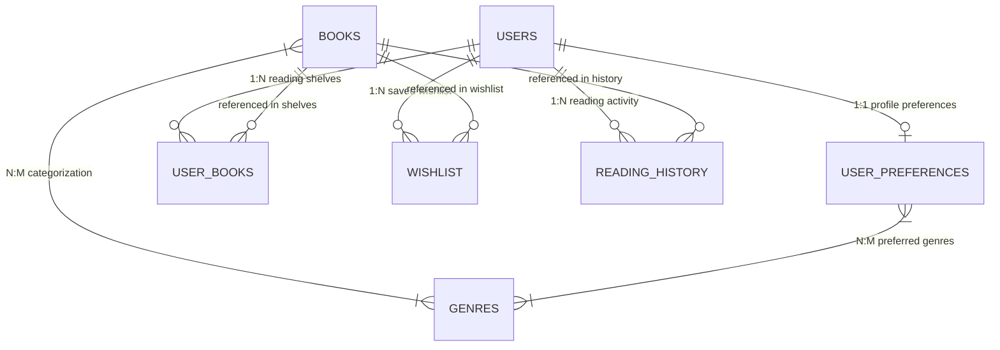

# SmartBook — Full-Stack Reading Management & Recommendation Platform

[](https://www.python.org/)
[](https://flask.palletsprojects.com/)
[](https://www.sqlalchemy.org/)
[](https://www.mysql.com/)
[](https://www.sqlite.org/)
[](https://getbootstrap.com/)
[](test_e2e_full_qa.py)
[](LICENSE)

**SmartBook** is a production-grade full-stack web application that pairs an explainable, rule-based recommendation engine with personal reading shelf tracking, milestone history logging, and real-time synchronized metrics. Designed with an editorial bookstore aesthetic (Warm Ivory `#F7F5EF`, Deep Forest Green `#163E30`, Charcoal `#252A27`, Muted Terracotta `#C87961`), SmartBook delivers a modern, responsive web experience across desktops, tablets, and mobile devices.

---

## 🌟 Key Features

- 🎯 **Rule-Based Recommendation Engine**: Deterministic multi-factor scoring algorithm evaluating genre affinity, reading duration preference, preferred language, age appropriateness, and profile keywords to calculate a 0–100% compatibility score with natural language explanations.
- 📚 **Multi-Shelf Reading Management**: Seamless transitions across *Want to Read*, *Currently Reading*, and *Completed* shelves with real-time page progress calculation and reading milestone logging.
- 💖 **Interactive Wishlist**: Save discovered books with instant toggle actions and atomic one-click transfers to your personal reading library.
- 📜 **Chronological Reading History**: Milestone timeline tracking books started, daily reading progress updates, and completion dates.
- 📊 **Single-Source-of-Truth Statistics**: Centralized statistics calculation service (`stats_service.py`) keeping metrics synchronized across the Dashboard, My Books, Reading History, and Profile views.
- 📱 **Responsive Mobile Drawer Navigation**: Slide-over offcanvas drawer with backdrop overlay on mobile and tablet viewports, integrated with top search and quick profile actions.
- 🔔 **Global Auto-Dismissing Notification System**: Flash and toast alerts with automatic 5-second countdowns, hover-to-pause, and accessible manual dismissal.
- 👤 **Comprehensive Profile Management**: Manage personal information, security credentials, reading preferences, and notification toggles with dynamic unsaved-changes indicators.
- 🛡️ **Production-Hardened Security**: Scrypt password hashing via Werkzeug, secure session cookies (`HttpOnly`, `SameSite=Lax`, configurable `Secure`), CSRF protection, and MySQL connection pooling with SQLite automatic fallback.

---

## 🏗️ System Architecture

SmartBook is architected with a modular Flask Application Factory pattern, separating routing, business logic, data models, and services:

```
SmartBook/
├── app.py                     # Flask application factory & health-check endpoints
├── wsgi.py                    # Production WSGI entry point (Gunicorn / Waitress)
├── config.py                  # Environment configuration classes (Dev, Test, Prod)
├── models.py                  # SQLAlchemy ORM models & database relationships
├── stats_service.py           # Unified reading metrics and statistics calculation
├── recommendation_engine.py   # Multi-factor rule-based recommendation algorithm
├── seed_data.py               # Database seeder (catalog & demo dataset)
├── requirements.txt           # Python dependency specifications
├── .env.example               # Environment variables configuration template
├── .gitignore                 # Version control ignore rules
├── LICENSE                    # MIT Open-Source License
│
├── routes/                    # Modular Flask Blueprints
│   ├── __init__.py            # Blueprint registration package
│   ├── auth.py                # Authentication (Login, Register, Logout)
│   ├── main.py                # Core page views (Dashboard, Explore, Shelves, Profile)
│   └── api.py                 # RESTful JSON APIs (Library, Wishlist, Recommendations)
│
├── templates/                 # Jinja2 HTML Templates
│   ├── base.html              # Base layout with navigation and alert containers
│   ├── auth/                  # Split-screen Login and Registration templates
│   ├── components/            # Reusable partials (alerts, modals, toasts)
│   └── main/                  # Dashboard, Explore, My Books, Wishlist, History, Profile
│
├── static/                    # Client-Side Assets
│   ├── css/                   # Scoped stylesheets (dashboard, auth, alerts, variables)
│   ├── js/                    # Vanilla JavaScript modules (alerts, nav, shelves, profile)
│   └── images/                # Brand SVGs, icons, and illustrations
│
└── test_*.py                  # Automated test suites (Auth, E2E QA, Stats, Flow)
```

---

## 🧮 Recommendation Algorithm

The recommendation engine evaluates candidate books deterministically against the user's profile and reading preferences using weighted scoring components:

$$\text{Score}_{\text{Total}} = S_{\text{Genre}} + S_{\text{Language}} + S_{\text{Age}} + S_{\text{Duration}} + S_{\text{Interests}}$$

| Factor | Max Points | Evaluation Logic |
| :--- | :---: | :--- |
| **Genre Overlap** | **40** | Ratio of book genres overlapping with user preferred genres $\times 40$ |
| **Language Match** | **20** | Full points if book language matches user preferred language |
| **Age Appropriateness** | **15** | Full points if user age falls within $[\text{min\_age}, \text{max\_age}]$ |
| **Reading Duration** | **15** | Full points if page duration matches user preferred length (*Short*, *Medium*, *Long*, or *Any*) |
| **Profile Keywords** | **10** | Token overlap ratio between user interest tags and book metadata corpus |

### Multi-Tier Ranking Strategy
Books are sorted deterministically:
1. **Match Score** (Descending)
2. **Community Rating** (Descending)
3. **Publication Year** (Descending)
4. **Title** (Alphabetical)

---

## 🗄️ Database Schema & Relationships



- **`User`**: User accounts with scrypt hashed credentials, contact information, avatar URL, and notification toggles.
- **`Book`**: Book catalog with ISBN, author, page count, reading duration tier, target age bounds, rating, and genre tags.
- **`UserBook`**: Junction table managing reading statuses (`want_to_read`, `currently_reading`, `completed`), current page, start date, and completion date.
- **`Wishlist`**: User wishlist entries supporting atomic transfer to personal reading shelves.
- **`ReadingHistory`**: Milestone and progress event log for audit trails and reading history timeline.
- **`UserPreference`**: Personalized genre choices, reading speed, duration targets, and interest keywords.

---

## 🔌 RESTful API Endpoints

| Method | Endpoint | Description | Auth Required |
| :--- | :--- | :--- | :---: |
| `POST` | `/auth/register` | Register a new user account | No |
| `POST` | `/auth/login` | Authenticate and create user session | No |
| `POST` | `/auth/logout` | Terminate user session | Yes |
| `GET` | `/api/books` | Search catalog with genre, language, and sorting filters | Yes |
| `GET` | `/api/library` | Fetch user reading library grouped by status shelf | Yes |
| `POST` | `/api/library` | Add book to shelf or update reading status & pages | Yes |
| `DELETE` | `/api/library/<book_id>` | Remove book from reading library | Yes |
| `GET` | `/api/wishlist` | Fetch all books in user wishlist | Yes |
| `POST` | `/api/wishlist` | Toggle book presence in wishlist | Yes |
| `GET` | `/api/recommendations` | Get personalized book recommendations with scores | Yes |
| `GET` | `/api/recommendations/explain/<book_id>` | Get detailed score breakdown and explanation | Yes |
| `GET` | `/api/history` | Get reading activity timeline and completed books | Yes |
| `GET` | `/api/user/profile` | Retrieve profile information and preferences | Yes |
| `POST` | `/api/user/profile` | Update profile information and notification settings | Yes |
| `POST` | `/api/user/password` | Update account password securely | Yes |
| `GET` | `/health` | Application health and database connectivity probe | No |

---

## 🚀 Installation & Local Setup

### 1. Prerequisites
- **Python**: 3.10 or higher
- **Git**
- **MySQL 8.0+** (Optional — SQLite fallback works out-of-the-box)

### 2. Clone the Repository
```bash
git clone https://github.com/krushnafunde715/SmartBook.git
cd SmartBook
```

### 3. Create & Activate Virtual Environment
```bash
# Windows (PowerShell)
python -m venv venv
.\venv\Scripts\Activate.ps1

# Linux / macOS
python3 -m venv venv
source venv/bin/activate
```

### 4. Install Dependencies
```bash
pip install -r requirements.txt
```

### 5. Configure Environment Variables
Copy the template configuration file:
```bash
cp .env.example .env
```
*(Optionally adjust `.env` parameters if connecting to a dedicated MySQL server)*.

### 6. Initialize & Seed Database
```bash
python seed_data.py
```

### 7. Run the Application
```bash
python app.py
```
Open your browser and navigate to **`http://127.0.0.1:5000/`**.

---

## 🧪 Automated Testing

SmartBook includes a comprehensive test suite covering authentication, API contracts, shelf transitions, cross-page data synchronization, and end-to-end user workflows:

```bash
python -m unittest discover -s . -p "test_*.py"
```

### Test Suite Summary
- `test_e2e_full_qa.py`: End-to-end user journey (auth, library shelves, wishlist, history, profile, and recommendations).
- `test_backend_full_audit.py`: Backend integration tests for all REST API endpoints and data validation.
- `test_stats_synchronization.py`: Single source of truth verification across stats service and database queries.
- `test_alert_system.py`: Flash and toast alert auto-dismissal rules and message delivery.
- `test_all_buttons_flow.py`: Interactive button and action verification across all views.
- `test_logout_flow.py`: Session termination and cache-control security headers.

---

## 🚢 Production Deployment

SmartBook is production-ready for WSGI application servers (Gunicorn, Waitress) behind an Nginx reverse proxy.

### Running with WSGI
**Linux / Production (Gunicorn):**
```bash
gunicorn -w 4 -b 0.0.0.0:5000 wsgi:app
```

**Windows / Staging (Waitress):**
```bash
waitress-serve --listen=127.0.0.1:5000 wsgi:app
```

For detailed production deployment instructions (systemd service, Nginx SSL configuration, MySQL pooling), see [DEPLOYMENT.md](DEPLOYMENT.md).

---

## 📄 License

This project is licensed under the MIT License — see the [LICENSE](LICENSE) file for details.

---

## 👤 Author

**Krushna Funde**
- GitHub: [@krushnafunde715](https://github.com/krushnafunde715)
- Repository: [SmartBook](https://github.com/krushnafunde715/SmartBook)
